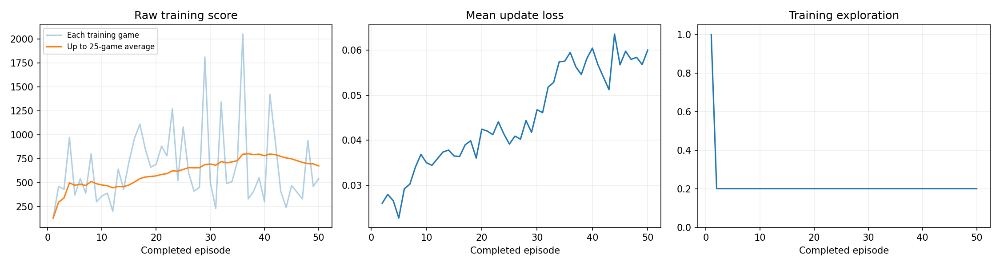
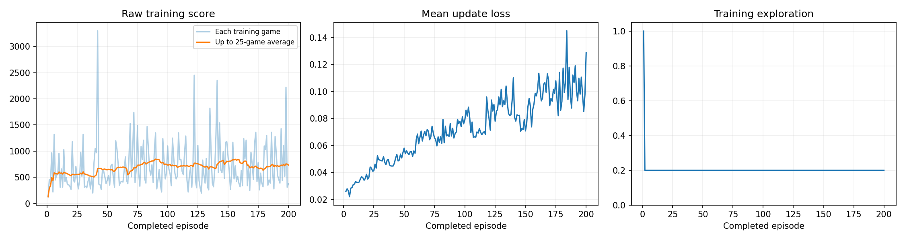
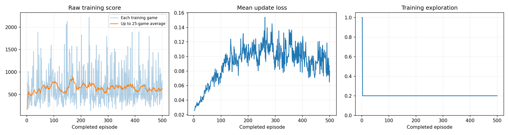
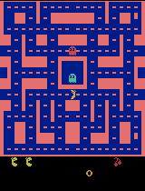
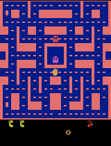
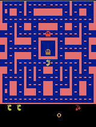

# Ms. Pac-Man DQN: 50, 200, and 500 training episodes

**The fresh 500-episode run completed, but its official mean of 450 was below both earlier runs: 534 after 200 episodes and 800 after 50.** It improved from its own untrained mean of 218 by 232 points (+106.4%). The earlier runs shared an untrained mean of 492. The 50-run mean was strongly influenced by one 2,060-point game. Because the 500-run changed the budget, training seed, and learning-rate schedule together, this result cannot identify the effect of any one change.

| Fresh experiment | Official untrained mean | Official trained mean | Change from its own baseline |
|---|---:|---:|---:|
| 50 episodes, constant rate | 492 | 800 | +308 (+62.6%) |
| 200 episodes, constant rate | 492 | 534 | +42 (+8.5%) |
| 500 episodes, rate decay and new seed | 218 | 450 | +232 (+106.4%) |

The final notebook is [pacman_dqn.ipynb](pacman_dqn.ipynb), preserving the executed **500-episode** run. Earlier runs remain in [the 50-episode notebook](notebooks/pacman_dqn_50_episodes.ipynb) and [the 200-episode notebook](notebooks/pacman_dqn_200_episodes.ipynb). Training and both final evaluations finished, and the saved checkpoint was reloaded for evaluation. The notebook preserves all 59 exported outputs. Its final explanation includes a gallery of the same saved GIFs, because GitHub's notebook renderer otherwise shows text placeholders for GIF output records. Colab exported null execution counters after reopening; these were left unchanged and the outputs were reconciled against the downloaded results. See [verification and export provenance](methods/verification_500.md).

## Choices and predictions recorded before training

All experiments use the supplied DQN and **start fresh** with untrained weights, empty replay memory, reset optimizer, and new results folders. They are not successive continuations of one model.

| Choice | 50 episodes | 200 episodes | 500 episodes | Rationale |
|---|---:|---:|---:|---|
| Exploration after warm-up | 0.20 | 0.20 | 0.20 | Keep trying random moves while usually selecting the highest learned action value. |
| Requested episode budget | 50 | 200 | 500 | Start with two budgets, then investigate a longer run after the 200-episode result underperformed. |
| Learning rate | Constant 0.0001 | Constant 0.0001 | Starts at 0.0001; schedule below | Retain the supplied reference initially; reduce later update sizes in the follow-up. |
| Training seed | 42 | 42 | 31415 | The follow-up deliberately uses a new initialization and training random sequence. |

The [original plan](methods/experiment_plan.json) recorded:

> The 200-episode agent may collect more pellets and achieve a higher five-game mean than the 50-episode agent because it receives more experience and updates. Improvement is uncertain; outcomes may be noisy or deteriorate.

The 200-episode mean did not support its predicted advantage. Its recorded configuration and software versions matched the 50-episode run except for `episodes_requested`.

The [500-episode plan](methods/experiment_plan_500.json) recorded:

> More experience and smaller later updates may improve pellet collection and reduce unstable updates, but improvement is uncertain.

| 500-run episodes | Learning rate |
|---|---:|
| 1–125 | 0.0001 |
| 126–250 | 0.00008 |
| 251–375 | 0.000064 |
| 376–500 | 0.0000512 |

At the start of episodes **126, 251, and 376**, the rate drops by 20%. Every training CSV row records its applied rate. This is scheduled decay, not a performance-triggered backoff rule. Training episode resets use seeds **31416–31915**. The **budget, training seed, and learning-rate schedule change together**, so this follow-up cannot isolate which change explains an outcome.

## Actual training budget and hardware

| Measure | Fresh 50 | Fresh 200 | Fresh 500 |
|---|---:|---:|---:|
| Status | Completed | Completed | Completed |
| Completed episodes | 50 | 200 | 500 |
| Agent decisions | 29,824 | 118,833 | 292,152 |
| Learning updates | 7,207 | 29,459 | 72,789 |
| Training seconds, including periodic demos | 109.55 | 433.49 | 1,150.27 (19.17 min) |
| Hardware | Colab T4 / CUDA | Colab T4 / CUDA | Colab T4 / CUDA |
| Python | 3.13.15 | 3.13.15 | 3.13.15 |
| PyTorch | 2.11.0+cu128 | 2.11.0+cu128 | 2.11.0+cu128 |

Elapsed training time includes periodic evaluations and saving work, excluding setup, baseline/final evaluations, and archive download. Variable game lengths mean episode counts are not identical to decisions or update counts. All three runtimes used Gymnasium **1.3.0**, ALE **0.11.2**, OpenCV headless **4.14.0.94**, NumPy **2.1.3**, Matplotlib **3.10.0**, and Pillow **11.3.0**.

| Evidence | 50 episodes | 200 episodes | 500 episodes |
|---|---|---|---|
| Executed notebook | [Notebook](notebooks/pacman_dqn_50_episodes.ipynb) | [Notebook](notebooks/pacman_dqn_200_episodes.ipynb) | [Final notebook](pacman_dqn.ipynb) |
| Settings and versions | [Config](results/run_50/config.json) | [Config](results/run_200/config.json) | [Config](results/run_500/config.json) |
| Completed-game log | [CSV](results/run_50/training.csv) | [CSV](results/run_200/training.csv) | [CSV](results/run_500/training.csv) |
| Actual training totals | [Summary](results/run_50/training_summary.json) | [Summary](results/run_200/training_summary.json) | [Summary](results/run_500/training_summary.json) |
| Official before/after scores | [Comparison](results/run_50/comparison.json) | [Comparison](results/run_200/comparison.json) | [Comparison](results/run_500/comparison.json) |
| Periodic demonstration scores | [Demos](results/run_50/demo_scores.json) | [Demos](results/run_200/demo_scores.json) | [Demos](results/run_500/demo_scores.json) |

## Official classroom evaluation

Every official before/after comparison uses seeds **101, 202, 303, 404, 505**, **5% exploration**, and a **3,000-decision limit**. The baseline is an **untrained neural network**, not a random-action agent. Evaluation uses a separate environment and random-number generator, without updating weights or replay memory. Final evaluation reloads the saved checkpoint.

### Completed 50- and 200-episode runs

| Seed | Untrained: run 50 | After 50 | Untrained: run 200 | After 200 | After 200 minus after 50 |
|---|---:|---:|---:|---:|---:|
| 101 | 350 | 450 | 350 | 360 | −90 |
| 202 | 500 | 510 | 500 | 510 | 0 |
| 303 | 320 | 2,060 | 320 | 680 | −1,380 |
| 404 | 800 | 430 | 800 | 430 | 0 |
| 505 | 490 | 550 | 490 | 690 | +140 |
| **Mean** | **492** | **800** | **492** | **534** | **−266** |

Both runs improved on four baseline seeds and worsened on one. Comparing 200 directly with 50, one seed improved, two tied, and two worsened; the median paired change was **0**. No baseline or final evaluation game reached the time limit. The 2,060-point seed-303 result strongly influenced the 50-run mean. Confidence is high in these recorded scores and arithmetic, but low that five games establish a general ranking of training budgets.

### 500-episode run — official score only

| Seed | Untrained | After 500 | Change |
|---|---:|---:|---:|
| 101 | 200 | 430 | +230 |
| 202 | 240 | 580 | +340 |
| 303 | 240 | 510 | +270 |
| 404 | 240 | 480 | +240 |
| 505 | 170 | 250 | +80 |
| **Mean** | **218** | **450** | **+232 (+106.4%)** |

All five games improved from this run's own baseline, with no ties, regressions, or time-limited games before or after training. The trained median was **480**. Its mean was **84 points lower than the 200-run (−15.73%)** and **350 lower than the 50-run (−43.75%)**. The changed initialization produced a different baseline, so its within-run improvement is measured against **218**. Scores and means match [comparison.json](results/run_500/comparison.json). The follow-up improved relative to its own baseline but did not exceed either earlier official mean. This multi-change experiment cannot establish whether more experience or the smaller later updates helped.

## Supplemental evaluation — separate from the classroom score

The 500-run also tests seeds **606, 707, 808, 909, 1010** before and after training using the same 5% exploration and 3,000-decision cap. Both evaluation sets are outside this run's training reset-seed range. Supplemental seeds are not used for periodic demonstrations. Do not combine these scores with the official five-game leaderboard mean.

| Supplemental seed | Untrained | After 500 | Change |
|---|---:|---:|---:|
| 606 | 240 | 910 | +670 |
| 707 | 230 | 420 | +190 |
| 808 | 300 | 830 | +530 |
| 909 | 240 | 370 | +130 |
| 1010 | 250 | 1,900 | +1,650 |
| **Mean** | **252** | **886** | **+634 (+251.6%)** |

Sources: [supplemental baseline](results/run_500/supplemental_baseline.json) and [supplemental comparison](results/run_500/supplemental_comparison.json). All five supplemental games improved, with no time-limited games before or after training. The trained median was **830**. The **1,900-point** game raises the mean; the other four trained games average **632.5**. This second seed set supports improvement from the 500-run's own baseline, but its much higher mean than the official set demonstrates sensitivity to the sampled games. There are no corresponding supplemental results for the 50/200 runs. The classroom score remains **450**.

## What the agent observes, does, and learns

The observations are **four consecutive 84 × 84 grayscale game screens**. Together they convey position and movement. The actions are the available joystick moves. The neural network estimates future reward for each action; its outputs are action values, not probabilities.

Game points supply rewards. Learning clips each reward to **−1 through +1**, while every score reported here retains the **original game points**. Experiences enter a replay memory, and random batches train the network. A periodically updated target network supplies the estimate of future reward. That future-reward term is removed at true game over and retained when the fixed time limit ends an episode.

The first **1,000 decisions** use random actions. Afterward, each training decision has a 20% chance of selecting a random action; otherwise it chooses the highest estimated action value. Losing one life does not end the training episode: it continues until game over or the time limit.

### Settings held fixed across all three runs

| Setting | Unchanged value |
|---|---|
| Environment | `ALE/MsPacman-v5` |
| Frames per decision | 4 |
| Observation | Four 84 × 84 grayscale screens |
| Sticky-action probability | 0.25 |
| Initial no-op randomization | Up to 30 actions |
| Episode limit | 3,000 decisions, approximately 200 seconds of game time |
| Replay capacity | 5,000 decisions |
| Batch size | 32 experiences |
| Fully random warm-up | First 1,000 decisions |
| Learning frequency | Every 4 decisions, starting at decision 1,000 |
| Target-network synchronization | Every 1,000 decisions |
| Discount factor | 0.99 |
| Periodic demonstration interval | Every 25 episodes |
| Evaluation seeds / exploration / limit | Five seeds listed above / 0.05 / 3,000 decisions |

## Training curves

### 50 episodes

Training scores varied substantially. The rolling mean rose during the middle of the run and fell near the end. The first 25 games averaged **637.2** points and the final 25 averaged **673.6**. Mean update loss rose overall; this does not establish better or worse gameplay by itself.

### 200 episodes

The first 25 training games averaged **553.2** points and the final 25 averaged **736.4**. Individual scores swung substantially; the rolling average fluctuated and ended below earlier peaks. Update loss trended upward overall. The higher late-training score average did not translate into a higher final five-game evaluation mean than the shorter experiment. Training uses 20% exploration after warm-up; evaluation uses 5%, so their score distributions are not interchangeable.

### 500 episodes

The first 25 training games averaged **584.0** points and the final 25 averaged **637.6**. The 25-game rolling mean peaked at **891.2**, ending at episode **170**, then repeatedly rose and fell. The final window remained below that earlier peak. The four successive 125-episode blocks averaged **633.84, 686.00, 653.76, and 621.84**. Update loss rose earlier and later fluctuated below its largest peaks; this does not establish better gameplay. Exploration settled at 0.20 after warm-up. Every CSV learning rate matched the schedule, including transitions at episodes 126, 251, and 376. The supplied dashboard displays score, loss, and exploration; it does not chart learning rate.

## Gameplay evidence and observations

All GIFs show **at most the first 20 seconds of game time at 4× playback speed**. Full-game scores cover the entire evaluated game. The final GIF is selected from the game with the highest full-game score among five evaluations, so its excerpt is an illustration rather than representative evidence by itself. Baseline and periodic GIFs use seed 101; the best final GIF can use another seed.

### Fresh 50-episode run

**Untrained:**

**After 25 episodes:**

**After 50 episodes:**

**Best final evaluation game — seed 303, full-game score 2,060:**

Inspection of the saved GIF frames showed the baseline clearing portions of the upper maze, while the episode-50 demonstration followed a different route through parts of the lower-left and bottom corridors. Both collected pellets. In the episode-50 excerpt, a reserve-life icon disappeared and Pac-Man returned to the central start area; the baseline retained its two reserve-life icons throughout its excerpt. These clips do not establish more reliable ghost avoidance.

The best final excerpt's displayed score reached **300**, although the full game scored **2,060**. Most points in that game therefore came from events outside the excerpt. Confidence in these observations is high but limited to the displayed frames.

### Fresh 200-episode run

**Untrained:**

**After 25 episodes:**

**After 50 episodes:**

**After 75 episodes:**

**After 100 episodes:**

**After 125 episodes:**

**After 150 episodes:**

**After 175 episodes:**

**After 200 episodes:**

**Best final evaluation game — seed 505, full-game score 690:**

In the same-seed comparison, the baseline cleared sections of the upper maze. The final 200-episode demonstration instead collected pellets in lower-left, bottom, and right-side passages, and the ghosts visibly entered their blue frightened state after Pac-Man reached the lower-right power-pellet area. Both excerpts retained two reserve-life icons, so these clips do not demonstrate improved ghost avoidance.

A concrete limitation was revisiting already-cleared corridors: the 200-episode agent's displayed score stayed at **290** through the late part of its seed-101 excerpt. The baseline excerpt reached **350**. Their full-game scores were **350 before training and 360 after**, which are separate from the excerpt endpoints. In the selected best game, seed 505, the trained agent lost a life and continued after returning to the central start area. Its excerpt reached **470**, while the full game scored **690**.

All eight intermediate GIFs were inspected through sampled frames. Their routes, repeated visits to cleared corridors, and occasional life losses did not show a consistent progression. The episode-175 GIF was identical to the untrained GIF, including all decoded frames; its seed-101 score and length also matched the baseline at **350 points and 560 decisions**. This establishes identical recorded behavior in that sample without establishing why it occurred. Confidence is high for these visible observations and limited for broader claims about learned strategy.

### Fresh 500-episode run

All **22 saved GIFs** were decoded and reviewed using sampled frames: the baseline, every 25-episode demonstration, and the best final official game. The original evidence files are preserved.

**Untrained — official seed 101:**

**After 25 episodes:**

**After 50 episodes:**

**After 75 episodes:**

**After 100 episodes:**

**After 125 episodes:**

**After 150 episodes:**

**After 175 episodes:**

**After 200 episodes:**

**After 225 episodes:**

**After 250 episodes:**

**After 275 episodes:**

**After 300 episodes:**

**After 325 episodes:**

**After 350 episodes:**

**After 375 episodes:**

**After 400 episodes:**

**After 425 episodes:**

**After 450 episodes:**

**After 475 episodes:**

**After 500 episodes:**

**Best final official evaluation game — seed 202, full-game score 580:**

The same-seed trained agent collected pellets through more lower and right-side passages during the opening excerpt, reaching **320** points versus **170** for its own untrained baseline. Their complete seed-101 games scored **430 and 200**, respectively. The trained agent also backtracked through a cleared lower-left passage while the displayed score stayed at 90. Both excerpts showed a lost life and a return to the central start area. These clips support changed routing and pellet collection, but not reliable ghost avoidance or consistently efficient navigation.

The best final official game used **seed 202**, scored **580** over the complete game, and reached **450** in its excerpt. It also showed a life loss. It is a different seed and a selected best game, so it is not a matched visual comparison with the baseline.

All 20 periodic clips were inspected. Performance changed irregularly: complete seed-101 scores were **1,650 at episode 425**, **520 at 450**, **220 at 475**, and **430 at 500**. The episode-125 excerpt revisited cleared lower-right passages with the score remaining at 280 across the final sampled frames. The baseline and episode-300 GIFs were byte-identical, including all 75 decoded frames, but their full games differed (**200 points / 482 decisions** versus **260 / 522**). This establishes identical recorded openings, not identical full games or a cause. Confidence is high for these visible observations, with conclusions limited to the short excerpts.

## Limitations and next experiment

Observed limitations include **revisiting cleared corridors without gaining points** in the 200-episode excerpt and **inconsistent performance across games**: the 50-episode scores ranged from **430 to 2,060**, and its mean advantage depended heavily on one game. The trained medians were 510, 510, and 480 respectively, and trained gameplay excerpts still showed lost lives. More experience did not produce reliably better evaluation performance in this test.

There is one fresh training run per configuration, with seed 42 used for the 50/200 experiments and seed 31415 for the 500 experiment. Each official evaluation contains only five games. Seed 101 is also reused in periodic demonstrations, so the official set is not a wholly untouched evaluation set. The notebook does not force deterministic CUDA operations. Although the 50/200 configurations matched apart from requested episodes, their early training histories differed: first-25-game means were 637.2 and 553.2. The cause is not established. Confidence is high in the saved measurements and low in a general ranking of training budgets or a causal explanation of the differences. Repeated training runs would be needed for a stronger conclusion.

The reset-seed overlap also differs: the 50-run used training reset seeds **43–92**, excluding every official evaluation seed; the 200-run used **43–242**, which includes official evaluation seeds **101 and 202**. The 500-run uses **31416–31915**, excluding both evaluation sets. Repeating an environment reset seed does not imply an identical trajectory because policy actions can differ. This further limits strong cross-budget causal claims.

For the 500-run, changing seed, budget, and schedule together prevents isolating one cause. Its baseline mean is also different. The supplemental set is a second small sample, not repeated training runs or a reliable population estimate. Keep official and supplemental conclusions separate.

The 500-run still revisited cleared corridors and lost lives, and its final official mean was below both earlier runs despite more updates. **Proposed next experiment, not run:** hold the 500-episode budget, seed 31415, exploration 0.20, and evaluation settings fixed, and change only the learning-rate decay factor from **0.8 to 1.0**. This would compare the scheduled run with constant 0.0001 and help assess the schedule's contribution, while still acknowledging CUDA nondeterminism. This tests whether the smaller late updates contributed to the observed result, without simultaneously changing the training budget or seed again.

## Abandoned CPU setup attempt

The first accelerator selection did not apply, so an initial attempted 50-episode run used CPU with PyTorch `2.11.0+cpu`. It reached **at least two completed episodes and at least 1,000 decisions / one learning update** before the runtime was replaced. It did not complete final evaluation or archive download, so no complete before/after result exists for that attempt. It is recorded here as an abandoned setup attempt and excluded from the formal GPU experiments.

## Open and reproduce

1. Download [pacman_dqn.ipynb](pacman_dqn.ipynb) and upload it into [Google Colab](https://colab.research.google.com/), or use Jupyter/VS Code with Python 3.11–3.13. Keep `pacman_player.py` beside it for optional local popup playback; Colab displays GIFs inline.
2. Select **Runtime → Change runtime type → T4 GPU**, when available. Verify that the device check actually reports **CUDA**; the selected option alone is insufficient.
3. For the final experiment, use exploration **0.20**, episodes **500**, initial rate **0.0001**, seed **31415**, and the documented decay schedule. Choose **Run all** to create a fresh model, replay memory, and results folder. Do not resume the 50- or 200-episode checkpoints.
4. To reproduce an earlier experiment, open its archival notebook, which preserves seed **42** and a **constant 0.0001** rate. Merely changing the final notebook's episode count would not reproduce those earlier methods.
5. Let baseline evaluation, training, both final evaluation sets, and ZIP creation finish. Download the ZIP and executed `.ipynb` **with outputs intact** before ending the session. Keep runs separately. Package/hardware changes and nondeterministic CUDA operations may change results.

### Full archives and checkpoints

Complete archives are retained locally and excluded from the repository:

- **50 episodes:** `20260917_203726_996221.zip`
- **200 episodes:** `20260917_204033_429685.zip`
- **500 episodes:** `20260918_160133_643037.zip`

Each contains `untrained.pt`, `trained.pt`, and the periodic `episode_XXXX.pt` checkpoints. The completed 500-run preserves **22 checkpoints**, including 20 at episodes 25–500, and **22 gameplay GIFs**. Checkpoints support playback; they lack optimizer, replay, and emulator state needed for exact training resumption. Smaller evidence files and executed notebooks belong in this repository.

The full 500 ZIP passed its integrity check. The [500-run audit](methods/audit_500.md) passed **5,507 checks**, with **zero errors and one documented warning** for Colab's missing exported execution counters. All 28 code-cell sources match the prepared notebook; all 500 printed training rows, both evaluation tables, rate transitions, and saved images reconcile with the downloaded evidence. Only the final explanatory markdown cell was annotated in the submission copies. [Verification details](methods/verification_500.md) document the raw export and archive hashes. The public repository is [shahdevansh/pacman-dqn-class3](https://github.com/shahdevansh/pacman-dqn-class3). See the [publication verification record](methods/publication_verification.md) for access and rendering checks. bCourses submission is a separate step performed by the student.

## Sources and attribution

The DQN and playback helper are based on the supplied [pepealonso95/pacman-dqn classroom project](https://github.com/pepealonso95/pacman-dqn), following the [Class 3 assignment instructions](https://docs.google.com/document/d/1lnn9etY1Utpf-FMMyoatUjxzli02-FHXIFWo_KDW3n4/edit). The [original plan](methods/experiment_plan.json) records the starter URL and SHA-256; the [follow-up plan](methods/experiment_plan_500.json) records the authorized schedule and seed changes. The supplied learning algorithm was used to run, preserve, compare, and interpret these experiments.
